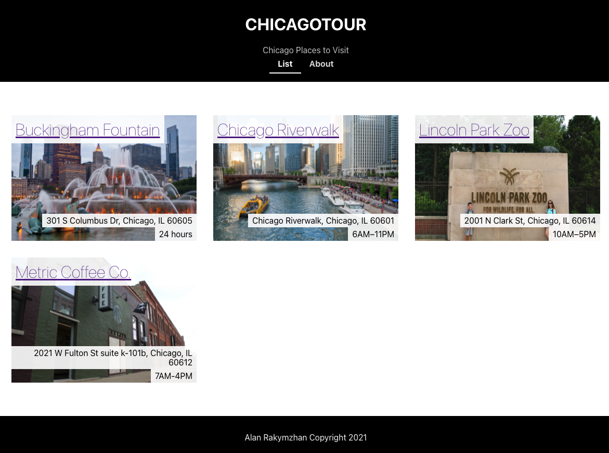

---

Styling Places

---

## Styling Places

The PLACESSpace component displays a a single place in the list of places on the home page. Each of these displays an image, the name of the place, it's address, and hours.

## Using ancestor selector

Styles have been divided between several style sheets. To keep these styles from conflicting you'll use the strategy of assigning the root element in a component class name that matches the component name. The Component names should be unique like class names. You should also use this class name as the ancestor for other styles applied within the component. For example:

```CSS
.PLACESSpace {
    /* Styles for the root element */
}

.PLACESSpace img {
    /* Styles for img inside this component */
}
```

The second style above styles img tags but only if they are descendants of an element with the class name: PLACESSpace. This way the styles here don't affect img tags elsewhere on the page.

## Styling PLACESSpace

Create a new stylesheet if you having. This should be a in the same folder as the `PLACESSpace.js` file.

> [action]
>
> Create a new file named: `PLACESSpace.css`. This should be in the same folder as the `PLACESSPace.js` file.
>

Import the CSS and add the class name:

> [action]
>
> Add the following at the top of `PLACESSpace.js`:
>
```JS
import './PLACESSpace.css'
```
>
> Now add the class to the root element:
>
```JS
function PLACESSpace(props) {
  ...
  return (
    <div className="PLACESSpace">
            ...
    </div>
  )
}
```

Now you'll add some styles to style the elements here.

It would be nice if the images were flexible. The columns of the grid change size as the page changes sizes.

> [action]
>
> Add the following to: `PLACESSpace.css`:
>
```CSS
.PLACESSpace img {
    width: 100%;
}
```

You might have to refresh to make sure the changes to CSS show up when testing.

With this change the images in PLACESSpace should have a width of 100% of the available place.

## Have some fun with the title

Let's move the title to the upper left corner of the picture. To do this you'll use relative and absolute position.

The structure of the PLACESpace is:

- div.PLACESSpace
    - Link
        - img
    - Link
        - h1 (title)
    - div (address)
    - div (hours)

By making the parent component `div.PLACESSpace` position relative it will become the positioning context for any children that use absolute position. When an element uses absolute position you can position it by it's left and top edges. To figure where the top and left are the element looks up the DOM tree for an element that has `position: relative`.

Give it a try!

> [action]
>
> Edit `PLACESSpace.css `, set the position property of the parent element to relative.
>
```CSS
.PLACESSpace {
    position: relative;
}
```

Now add a new classname to the title element. This is in a Link component, you'll need to assign this a className.

> [action]
>
> In `PLACESSpace.js` find the name in it's Link tag and add a new class name.
>
```JS
function PLACESSpace(props) {
  ...
  return (
    ...
            <Link
                className="PLACESSpace-title" // add a class name!
                to={`/details/${id}`}>
                <h1>{name}</h1>
            </Link>
            ...
  )
}
```

Next style the new class.

> [action]
>
> In `PLACESSpace.css` add some new style rules:
>
```CSS
.PLACESSpace .PLACESSpace-title {
    display: block;
    position: absolute;
    left: 0;
    top: 0;
}
>
.PLACESSpace h1 {
    margin: 0;
    font-weight: lighter;
    background-color: rgba(255, 255, 255, 0.9);
    padding: 0.5rem;
    text-align: left;
}
```

This should move the title to the upper left corner and give it some font styles.

Now move the address and hours to the lower right corner. It will ne easier if these elements share a common parent.

> [action]
>
> Edit `PLACESSpace.js`:
>
```JS
...
function PLACESSpace(props) {
  ...
  return (
    <div className="PLACESSpace">
            ...
            <div className="PLACESSpace-info">
                <div >{address}</div>
                <div>{hours}</div>
            </div>
    </div>
  )
}
```


Now with a a parent element and a class name we can apply styles to the parent and it's children.

> [action]
>
> Edit `PLACESSpace.css` and add thw following.
>
```CSS
.PLACESSpace .PLACESSpace-info {
    position: absolute;
    right: 0;
    bottom: 0;
    text-align: right;
}
>
.PLACESSpace .PLACESSpace-info div {
    display: inline-block;
    padding: 0.25em 0.5em;
    background-color: rgba(255, 255, 255, 0.9);
}
```


Here the container `.PLACESSpace-info` is declared position absolute This way we can place it where we want. In this case we put it at right 0 and bottom 0 which make it hug the lower right corner. We also aligned the text to the right.

The `.PLACESSpace .PLACESSpace-info div` selector applies to the two child divs. Here we added some padding and a background color.

If you previously did strech challenge on hours:
```html
<div className="hours">{hours}</div>
```
You can override it with above css or keep it. Choice is yours.

If you come so far, you page should looks something similar to this:




# Now Commit

> [action]

```bash
$ git add .
$ git commit -m 'style places'
$ git push
```
